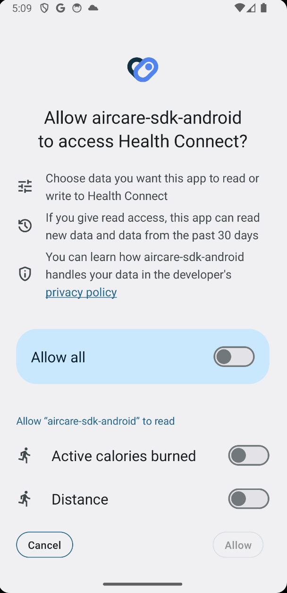

# AirCare SDK - Android

The Aircare Android SDK is used to collect user health data through Health Connect.

[Introduction about Health Connect](https://developer.android.com/health-and-fitness/guides/health-connect)

## Table of contents

- [AirCare SDK - Android](#aircaresdk)
  - [Data Types](#data-types)
    - [Unique identifier](#unique-identifier)
    - [Activity](#activity)
    - [Body measurements](#body-measurements)
    - [Cycle tracking](#cycle-tracking)
    - [Nutrition](#nutrition)
    - [Sleep](#sleep)
    - [Vitals](#vitals)
- [How to use SDK](#how-to-use-sdk)
  - [Import android library into your application](#import-android-library-into-your-application)
- [Health Connect with your application](#health-connect-with-your-application)
  - [Get started with Health Connect](#get-started-with-health-connect)
- [Features list](#features-list)
  - [Step Count Aggregator](#step-count-aggregator)
  - [Heart Rate Aggregator](#heart-rate-aggregator)
  - [Distance Total Aggregator](#distance-total-aggregator)
  - [Sleep Session Aggregator](#sleep-session-aggregator)
  - [Active Calories Burned Aggregator](#active-calories-burned-aggregator)

## Data Types

### Unique identifier

Health Connect assigns UIDs to newly inserted data objects. This makes it possible to identify data objects and distinguish them from others, especially when used in read, update, or delete requests.

- **Patient ID:** Alphanumeric data type assigned to each patient, serving as a unique identifier for their health records.
- **Medical Record Number (MRN):** A unique identifier used to track and manage a patient's medical records within a healthcare system.
- **National Identification Number:** A unique numeric identifier issued by a national authority for identification purposes.
- **Social Security Number (SSN):** In some countries, SSN serves as a unique identifier for individuals and is used for healthcare-related records.
- **Health Insurance ID:** Alphanumeric data type assigned by health insurance providers to uniquely identify insured individuals.
- **Biometric Data:** Unique biological characteristics such as fingerprints, retinal scans, or DNA profiles can serve as identifiers.
- **Electronic Health Record (EHR) ID:** A unique identifier assigned to an individual's electronic health record within a health information system.
- **Unique Patient Identifier (UPI):** A specific identifier designed for accurately matching patient records across different healthcare organizations.
- **Device ID:** In cases where health-related data is collected by devices, a unique identifier for the device capturing the data.
- **Study Participant ID:** If the system is used for research purposes, a unique identifier for participants in studies or clinical trials.
- **Employee ID:** For healthcare providers and staff, an identifier used to manage personnel records.
- **Emergency Contact ID:** Unique identifier for emergency contacts associated with a patient's record.
- **Laboratory Sample ID:** A unique identifier assigned to samples collected for laboratory testing.
- **Pharmacy Prescription ID:** Unique identifier associated with a prescription for medication.
- **Appointment ID:** A unique identifier for appointments scheduled within the healthcare system.
- **Healthcare Facility ID:** Identifier for healthcare facilities, useful in systems managing data across multiple facilities.
- **Care Team Member ID:** Unique identifier for members of a patient's care team, including physicians, nurses, and other healthcare professionals.
- **Health App User ID:** In systems that integrate with health apps, a unique identifier for users of these applications.
- **Research Study ID:** Unique identifier for specific research studies or clinical trials.
- **Healthcare Provider NPI (National Provider Identifier):** Unique identifier for healthcare providers used in the United States.

### Activity

This captures any activity that a user does. It can include health and fitness activities like running, swimming, and sleep.

- **Steps Count:** Numeric data type representing the number of steps taken.
- **Calories Burned:** Numeric data type indicating the amount of calories burned during an activity.
- **Distance:** Numeric data type for measuring the distance covered during an activity.
- **Duration:** Time-based data type representing the length of the activity.
- **Heart Rate:** Numeric data type capturing the user's heart rate during the activity.
- **Sleep Duration:** Time-based data type indicating the duration of sleep.
- **Intensity Level:** Categorical data type describing the intensity of the activity (e.g., low, moderate, high).
- **Activity Type:** Categorical data type specifying the type of activity (e.g., walking, running, cycling).
- **Location:** Spatial data type indicating the geographical location where the activity took place.
- **Weather Conditions:** Categorical data type describing the weather conditions during the activity.

### Body measurements

This captures common data related to the body. It includes capturing a user's weight, a user's basal metabolic rate, among other data types.

- **Height:** Numeric data type, often represented in centimeters or inches.
- **Weight:** Numeric data type, typically recorded in kilograms or pounds.
- **Body Mass Index (BMI):** Numeric data type calculated based on height and weight.
- **Waist Circumference:** Numeric data type, usually measured in centimeters or inches.
- **Hip Circumference:** Numeric data type, commonly measured in centimeters or inches.
- **Waist-to-Hip Ratio:** Numeric data type, calculated by dividing waist circumference by hip circumference.
- **Body Fat Percentage:** Numeric data type representing the proportion of body weight that is fat.
- **Muscle Mass:** Numeric data type indicating the amount of muscle tissue in the body.
- **Bone Density:** Numeric data type representing the density of bone tissue.
- **Basal Metabolic Rate (BMR):** Numeric data type indicating the number of calories the body needs at rest.
- **Hydration Level:** Numeric data type representing the body's water content.
- **Body Temperature:** Numeric data type representing the body's temperature, typically in Celsius or Fahrenheit.
- **Chest Circumference:** Numeric data type, often measured in centimeters or inches.
- **Arm Circumference:** Numeric data type, typically measured in centimeters or inches.
- **Leg Length:** Numeric data type representing the length of the legs.
- **Foot Size:** Numeric data type indicating the size of the feet, often in European or US shoe sizes.

### Cycle tracking

This captures menstrual cycles and related data points, such as the binary result of an ovulation test.

- **Menstrual Cycle Start Date:** Date data type representing the first day of the menstrual cycle.
- **Menstrual Cycle End Date:** Date data type representing the last day of the menstrual cycle.
- **Cycle Length:** Numeric data type indicating the duration of the menstrual cycle in days.
- **Menstrual Flow Intensity:** Categorical or numeric data type representing the level of menstrual flow (e.g., light, moderate, heavy).
- **Ovulation Date:** Date data type indicating the day of ovulation within the menstrual cycle.
- **Ovulation Symptoms:** Text or categorical data type for recording symptoms associated with ovulation.
- **Basal Body Temperature (BBT):** Numeric data type representing the body's temperature at rest, often measured in Celsius or Fahrenheit.
- **Cervical Mucus Quality:** Categorical data type indicating the characteristics of cervical mucus (e.g., dry, sticky, creamy, egg white).
- **Menstrual Symptoms:** Text or categorical data type for tracking symptoms related to menstruation (e.g., cramps, mood changes).
- **Sexual Activity:** Categorical data type indicating sexual activity during the menstrual cycle.
- **Pregnancy Test Results:** Categorical data type indicating the results of pregnancy tests.
- **Contraceptive Use:** Categorical data type indicating the use of contraceptives or birth control methods.
- **Mood and Energy Levels:** Categorical or numeric data type representing mood and energy variations throughout the cycle.
- **Physical Activity Levels:** Categorical or numeric data type indicating the level of physical activity during the menstrual cycle.

### Nutrition

This captures hydration and nutrition data types. The former represents how much water a user drank in a single drink. The latter includes many optional fields, such as calories, sugar and magnesium.

- **Food Item:** Text data type representing the name or description of a specific food item.
- **Portion Size:** Numeric data type indicating the size or quantity of a food portion, often measured in grams or ounces.
- **Calories:** Numeric data type representing the energy content of a food item.
- **Macronutrients:**
  - **Carbohydrates:** Numeric data type representing the amount of carbohydrates in grams.
  - **Proteins:** Numeric data type representing the amount of proteins in grams.
  - **Fats:** Numeric data type representing the amount of fats in grams.
  - **Dietary Fiber:** Numeric data type representing the amount of dietary fiber in grams.
- **Micronutrients:**
  - **Vitamins:** Text or numeric data type for tracking various vitamins (e.g., Vitamin A, Vitamin C).
  - **Minerals:** Text or numeric data type for tracking minerals (e.g., calcium, iron).
- **Serving Time:** Date and time data type indicating when a particular food item was consumed.
- **Meal Type:** Categorical data type indicating the type of meal (e.g., breakfast, lunch, dinner, snacks).
- **Meal Composition:** Text or categorical data type describing the composition of a meal (e.g., balanced, high-protein).
- **Water Intake:** Numeric data type representing the amount of water consumed in milliliters or ounces.
- **Allergens:** Text or categorical data type indicating any allergens present in a food item.
- **Nutritional Labels:** Text data type for storing information from nutritional labels on packaged foods.
- **Food Source:** Text data type indicating the source of the food (e.g., homemade, restaurant, packaged).
- **Nutritional Goals:** Numeric data type representing personalized nutritional goals (e.g., daily calorie intake, protein target).
- **Special Diets:** Categorical data type indicating adherence to special diets (e.g., vegetarian, vegan, gluten-free).
- **Food Preferences:** Text or categorical data type indicating personal food preferences or restrictions.

### Sleep

This captures interval data related to a user's length and type of sleep.

- **Sleep Start Time:** Date and time data type indicating when the individual begins sleeping.
- **Sleep End Time:** Date and time data type indicating when the individual wakes up.
- **Total Sleep Duration:** Numeric data type representing the total duration of sleep in hours.
- **Sleep Efficiency:** Numeric data type indicating the percentage of time spent asleep while in bed.
- **Sleep Quality:** Categorical or numeric data type representing subjective or objective measures of sleep quality.
- **Sleep Architecture:**
  - **Light Sleep Duration:** Numeric data type representing the duration of light sleep in hours.
  - **Deep Sleep Duration:** Numeric data type representing the duration of deep sleep in hours.
  - **REM Sleep Duration:** Numeric data type representing the duration of rapid eye movement (REM) sleep in hours.
- **Sleep Cycles:** Numeric data type representing the number of complete sleep cycles experienced.
- **Awake Episodes:** Numeric data type representing the number of times the individual wakes up during the night.
- **Sleep Latency:** Numeric data type representing the time it takes for the individual to fall asleep after going to bed.
- **Nap Duration:** Numeric data type representing the duration of any daytime naps.
- **Snoring Intensity:** Categorical or numeric data type indicating the intensity of snoring during sleep.
- **Sleep Environment:**
  - **Room Temperature:** Numeric data type representing the temperature of the sleep environment.
  - **Ambient Light Level:** Categorical or numeric data type representing the level of ambient light in the sleep environment.
  - **Noise Level:** Categorical or numeric data type representing the noise level in the sleep environment.
- **Sleep Patterns:** Text or categorical data type describing regular sleep patterns or irregularities.
- **Sleep Medications:** Categorical data type indicating the use of sleep aids or medications.
- **Dreams/Nightmares:** Text or categorical data type indicating the presence of dreams or nightmares during sleep.
- **Waking Mood:** Categorical or numeric data type representing the individual's mood upon waking.
- **Sleep Goals:** Numeric data type representing personalized goals for sleep duration or quality.

### Vitals

This captures essential information about the user's general health. It includes data such as blood glucose, body temperature and blood oxygen saturation.

- **Blood Pressure:**
  - **Systolic Pressure:** Numeric data type representing the systolic blood pressure reading.
  - **Diastolic Pressure:** Numeric data type representing the diastolic blood pressure reading.
  - **Blood Pressure** Category: Categorical data type indicating blood pressure status (e.g., normal, hypertensive).
- **Heart Rate/Pulse:**
  - **Resting Heart Rate:** Numeric data type representing the number of heartbeats per minute at rest.
  - **Maximum Heart Rate:** Numeric data type representing the highest heart rate achieved during activity.
  - **Respiratory Rate:** Numeric data type representing the number of breaths per minute.
- **Temperature:**
  - **Body Temperature:** Numeric data type representing the body's temperature, often in Celsius or Fahrenheit.
  - **Temperature Location:** Categorical data type indicating where the temperature was measured (e.g., oral, ear, forehead).
- **Oxygen Saturation:** Numeric data type representing the percentage of oxygen saturation in the blood.
- **Height:** Numeric data type representing the individual's height, often in centimeters or inches.
- **Weight:**
  - **Body Weight:** Numeric data type representing the individual's weight, often in kilograms or pounds.
  - **Weight Category:** Categorical data type indicating weight status (e.g., underweight, normal, overweight, obese).
- **Body Mass Index (BMI):** Numeric data type calculated based on height and weight.
- **Pain Level:** Numeric data type representing the intensity of pain on a scale.
- **Blood Sugar Level:**
  - **Fasting Blood Sugar:** Numeric data type representing blood glucose levels after a period of fasting.
  - **Postprandial Blood Sugar:** Numeric data type representing blood glucose levels after meals.
- **Cholesterol Levels:**
- **Total Cholesterol:** Numeric data type representing the total cholesterol level.
- **LDL (Low-Density Lipoprotein):** Numeric data type representing LDL cholesterol.
- **HDL (High-Density Lipoprotein):** Numeric data type representing HDL cholesterol.
- **Triglycerides:** Numeric data type representing triglyceride levels.
- **Allergies:** Text or categorical data type indicating any known allergies.
- **Medical Conditions** Text or categorical data type describing existing medical conditions.
- **Medication History:** Text or categorical data type listing current and past medications.
- **Pregnancy Status:** Categorical data type indicating pregnancy status.
- **Immunization Records:** Text or categorical data type tracking vaccination history.
- **Physical Activity Level:** Categorical or numeric data type indicating the level of physical activity.

## How to use SDK

### Import android library into your application

**Dowload .aar file in your local disk**
Dowload .aar file from my leader sent

**Add the dependency**

```
dependencies {
    ...
       implementation(files("your_path/aircare-sdk.aar"))
}
```

**Note:** your_path is the path .aar file saved

Now, your application can import the Android library package and start using it.

**Example:**

```
import com.example.aircare_sdk.StepCountAggregator
```

## Health Connect with your application

### Get started with Health Connect

**Add the Health Connect SDK to your app**
The Health Connect SDK is responsible for using the Health Connect API to send requests in performing operations against the datastore in the Health Connect app.
Add the Health Connect SDK dependency in your module-level **build.gradle** file:

```
dependencies {
  ...
   implementation ("androidx.health.connect:connect-client:1.1.0-alpha06")
  ...
}
```

Refer to the [Health Connect releases](https://developer.android.com/jetpack/androidx/releases/health-connect) for the latest version.

**Handling Permissions and Privacy Policy**
**1. Declare permissions**

Before you can read or write data, you need to declare all the permissions your app will use.
Declare read and write permissions on the **AndroidManifest.xml** file based on the required data types.
Health Connect uses the standard Android permission declaration format. Assign permissions with the **<uses-permission>** tags. Nest them within the **<manifest>** tags.

```
<manifest>
  <uses-permission android:name="android.permission.health.READ_HEART_RATE" />
    <uses-permission android:name="android.permission.health.READ_STEPS" />
    <uses-permission android:name="android.permission.health.READ_SLEEP" />
    <uses-permission android:name="android.permission.health.READ_DISTANCE" />
    <uses-permission android:name="android.permission.health.READ_ACTIVE_CALORIES_BURNED" />

  <application>
  ...
  </application>
</manifest>
```

**2. Show your app's privacy policy dialog**

Your Android manifest needs to have an Activity that displays your app's privacy policy, which is your app's rationale of the requested permissions, describing how the user's data is used and handled.

```
...
<application>
  ...
 
  <activity-alias
     ...
    // Permission handling for Android 14
    <intent-filter>
      <action android:name="android.intent.action.VIEW_PERMISSION_USAGE" />
      <category android:name="android.intent.category.HEALTH_PERMISSIONS" />
    </intent-filter>
  </activity-alias>
  ...
</application>
...
```

**3. Get a Health Connect client**

[Health ConnectClient](https://developer.android.com/reference/kotlin/androidx/health/connect/client/HealthConnectClient) is an entry point to the Health Connect API. It allows the app to use the datastore in the Health Connect app. It automatically manages its connection to the underlying storage layer and handles all IPC and serialization of outgoing requests and incoming responses.
To get a client instance, declare the Health Connect package name in your Android manifest first.

```
<application> ... </application>
...
//Check if Health Connect is installed
 <queries>
        <package android:name="com.google.android.apps.healthdata" />
        // The app needs to handle this intent and display an appropriate privacy policyexplaining how the user's data will be used and handled.

        //This intent is sent to the app when the user clicks on the "privacy policy" linkin the Health Connect permissions dialog.

        <intent>
            <action android:name="androidx.health.ACTION_SHOW_PERMISSIONS_RATIONALE" />
        </intent>
    </queries>
```

**4. Request permissions from the user**

After creating a client instance, your app needs to request permissions from the user. Users must be allowed to grant or deny permissions at any time.
To do so, create a set of permissions for the required data types. Make sure that the permissions in the set are declared in your Android manifest first.

```
import androidx.health.connect.client.HealthConnectClient
import androidx.health.connect.client.PermissionController
import androidx.health.connect.client.permission.HealthPermission

//from sdk
import com.example.aircare_sdk.data.AircareManager
...

/**
 * Coroutine scope for managing and controlling coroutines with a single-threaded dispatcher.
 *
 * This `CoroutineScope` is created with a new single-threaded dispatcher named "health,"
 * ensuring that coroutines launched within this scope will execute sequentially on a dedicated thread.
 *
 * Use this scope for coroutine operations that require sequential execution or to avoid
 * concurrent access issues, such as when working with shared resources that are not thread-safe.
 */
    private val scope = CoroutineScope(newSingleThreadContext("health"))

// Create a set of permissions for required data types
    val PERMISSIONS =
        setOf(
            HealthPermission.getReadPermission(HeartRateRecord::class),
            HealthPermission.getReadPermission(StepsRecord::class),
            HealthPermission.getReadPermission(DistanceRecord::class),
            HealthPermission.getReadPermission(SleepSessionRecord::class),
            HealthPermission.getReadPermission(ActiveCaloriesBurnedRecord::class),
        )

     // Create the permissions launcher
    val requestPermissionActivityContract = PermissionController.createRequestPermissionResultContract()

    /**
     * Registers an activity result launcher for requesting a set of permissions using the specified contract.
     *
     * @param requestPermissionActivityContract The contract for requesting permissions.
     * @param granted Callback invoked when the result of the permission request is received.
     * It provides a list of granted permissions.
     */
    val requestPermissions = registerForActivityResult(requestPermissionActivityContract) { granted ->
        if (granted.containsAll(PERMISSIONS)) {
            // Permissions successfully granted
        } else {
            // Lack of required permissions
        }
    }

    /**
     * suspend fun checkPermissionsAndRun a task using the provided HealthConnectClient.
     *
     * @param healthConnectClient The HealthConnectClient instance for accessing permission information.
     * @throws ActivityResultContractException if there is an issue with the activity result contract.
     */
    suspend fun checkPermissionsAndRun(healthConnectClient: HealthConnectClient) {
        val granted = healthConnectClient.permissionController.getGrantedPermissions()
        if (granted.containsAll(PERMISSIONS)) {
            // Permissions already granted; proceed with inserting or reading data
        } else {
            requestPermissions.launch(PERMISSIONS)
        }
    }


    override fun onCreate(savedInstanceState: Bundle?) {
        super.onCreate(savedInstanceState)
        /**
         * Initializes an instance of the AircareManager, allowing interaction with the AirCare SDK.
         *
         * @param thisRef The current context or component responsible for initializing the AircareManager.
         * @see AircareManager
         * @return An instance of AircareManager configured for the specified context.
         */
        val aircareManager = AircareManager(this)

        /**
         * Launches a coroutine within the 'health' coroutine scope to asynchronously check permissions
         * and execute a task using the provided HealthConnectClient.
         *
         * The coroutine is launched on a single-threaded dispatcher named "health," ensuring sequential
         * execution of the specified task. This is useful for operations that require thread safety
         * or sequential processing.
         *
         * @see CoroutineScope
         * @see newSingleThreadContext
         * @see checkPermissionsAndRun
         * @param aircareManager The AircareManager providing the HealthConnectClient for permission checks.
         */
        scope.launch {
            checkPermissionsAndRun(aircareManager.healthConnectClient)
        }

        setContent {
            MyApplicationTheme {
                // A surface container using the 'background' color from the theme
                Surface(
                    modifier = Modifier.fillMaxSize(),
                    color = MaterialTheme.colorScheme.background
                ) {
                    //your code here
                }
            }
        }
    }
```

Try to run and your application, you will see like this:



## Features list

### Step Count Aggregator

Captures the number of steps taken since the last reading. Each step is only reported once so records shouldn't have overlapping time. The start time of each record should represent the start of the interval in which steps were taken.

**SDK will provide an function to get total step:**

```
import com.example.aircare_sdk.StepCountAggregator
import com.example.aircare_sdk.data.AircareManager

/**
 * Initializes a StepCountAggregator and an AircareManager, then uses the StepCountAggregator
 * to aggregate step count data from the HealthConnectClient within the specified time range.
 *
 * @param stepAggregator An instance of StepCountAggregator for aggregating step count data.
 * @param aircareManager An instance of AircareManager providing the HealthConnectClient.
 * @param startTime The start time of the aggregation time range.
 * @param endTime The end time of the aggregation time range.
 */
val stepAggregator = StepCountAggregator()
val aircareManager = AircareManager()

// Aggregating step count data within the specified time range
stepAggregator.aggregate(aircareManager.healthConnectClient, startTime, endTime)
```

**Example:**

```
/**
 * A composable function to display a card aggregating step count data using the provided AircareManager.
 *
 * @param aircareManager An instance of AircareManager providing access to HealthConnectClient.
 */
@Composable
fun AggregateStepsCard(aircareManager: AircareManager) {
    // State to hold the aggregated step count, initially set to "Loading..."
    var stepCount by remember { mutableStateOf<String?>("Loading...") }

    // Time range for step count aggregation (last month to current moment)
    val startTime = ZonedDateTime.now().minusMonths(1).toInstant()
    val endTime = Instant.now()

    // StepCountAggregator instance for aggregating step count data
    val stepAggregator = StepCountAggregator()

    // Use LaunchedEffect to execute the step count aggregation when the aircareManager changes
    LaunchedEffect(key1 = aircareManager) {
        try {
            // Perform step count aggregation and update the UI
            val response = stepAggregator.aggregate(aircareManager.healthConnectClient, startTime, endTime)
            stepCount = response.toString()

        } catch (e: Exception) {
            // Handle exceptions by setting stepCount to null
            stepCount = null
        }
    }

    // Card composable to display the aggregated step count
    Card(
        modifier = Modifier
            .fillMaxWidth()
            .padding(16.dp),
        elevation = CardDefaults.cardElevation(
            defaultElevation = 8.dp
        )
    ) {
        Column(
            modifier = Modifier
                .padding(16.dp)
                .fillMaxWidth()
        ) {
            // Title: "Steps Total"
            Text(
                text = "Steps Total",
                fontWeight = FontWeight.Bold,
                fontSize = 20.sp
            )

            Spacer(modifier = Modifier.height(8.dp))

            // Display the aggregated step count
            Text(
                text = "$stepCount steps",
                fontWeight = FontWeight.Medium,
                fontSize = 16.sp
            )
        }
    }
}
```

### Heart Rate Aggregator

Record the user's average heart rate over a period of time

**SDK will provide an function to get avg heart rate, max heart rate, min heart rate, number of heart rate measurements:**

```
// Import necessary classes from the air care SDK
import com.example.aircare_sdk.data.AircareManager
import com.example.aircare_sdk.AvgHeartRateAggregator
import com.example.aircare_sdk.MinHeartRateAggregator
import com.example.aircare_sdk.MaxHeartRateAggregator
import com.example.aircare_sdk.MeasurementsHeartRateAggregator

// Create instances of different heart rate aggregators
val avgHeartRateAggregator = AvgHeartRateAggregator()
val minHeartRateAggregator = MinHeartRateAggregator()
val maxHeartRateAggregator = MaxHeartRateAggregator()
val measurementHeartRateAggregator = MeasurementsHeartRateAggregator()

// Create an instance of the AircareManager, assuming it has a healthConnectClient property
val aircareManager = AircareManager()

// Example of using the AvgHeartRateAggregator to aggregate average heart rate data
avgHeartRateAggregator.aggregate(
    aircareManager.healthConnectClient, // Provide the healthConnectClient instance
    startTime, // Replace with the actual start time variable or value
    endTime // Replace with the actual end time variable or value
)

// Note: Make sure to replace startTime and endTime with actual time values before running the code.
```

**Example about avg heart rate:**

```
// Composable function to display a card aggregating heart rate data
@Composable
fun AggregateHeartRateCard(aircareManager: AircareManager, cardIndex: Int) {
    // State to hold the average heart rate value, initially set to "Loading..."
    var heartRateAvg by remember { mutableStateOf<String?>("Loading...") }

    // Define the start and end times for the heart rate aggregation (last month to now)
    val startTime = ZonedDateTime.now().minusMonths(1).toInstant()
    val endTime = Instant.now()

    // Create an instance of AvgHeartRateAggregator
    val avgHeartRateAggregator = AvgHeartRateAggregator()

    // Use LaunchedEffect to perform heart rate aggregation asynchronously
    LaunchedEffect(key1 = aircareManager) {
        try {
            // Perform heart rate aggregation using AvgHeartRateAggregator
            val responseHeartRate = avgHeartRateAggregator.aggregate(aircareManager.healthConnectClient, startTime, endTime)

            // Update the state with the aggregated heart rate value
            heartRateAvg = responseHeartRate.toString()
        } catch (e: Exception) {
            // Handle exceptions, set heartRateAvg to null in case of error
            heartRateAvg = null
        }
    }

    // Create a Card composable with heart rate information
    Card(
        modifier = Modifier
            .fillMaxWidth()
            .padding(16.dp),
        elevation = CardDefaults.cardElevation(
            defaultElevation = 8.dp
        )
    ) {
        // Column composable to arrange text elements vertically
        Column(
            modifier = Modifier
                .padding(16.dp)
                .fillMaxWidth()
        ) {
            // Display the card title "Heart Rate" with bold styling
            Text(
                text = "Heart Rate",
                fontWeight = FontWeight.Bold,
                fontSize = 20.sp
            )

            // Spacer for vertical spacing
            Spacer(modifier = Modifier.height(8.dp))

            // Display the aggregated heart rate value
            Text(
                text = "$heartRateAvg bpm ",
                fontWeight = FontWeight.Medium,
                fontSize = 16.sp
            )
        }
    }
}
```

### Distance Total Aggregator

Captures distance travelled by the user since the last reading. The total distance over an interval can be calculated by adding together all the values during the interval. The start time of each record should represent the start of the interval in which the distance was covered.

**SDK will provide an function to get total distance:**

```
import com.example.aircare_sdk.DistanceTotalAggregator
import com.example.aircare_sdk.data.AircareManager
/**
 * Aggregates total distance data using DistanceTotalAggregator with the provided AircareManager.
 *
 * The code initializes a DistanceTotalAggregator and an AircareManager, then aggregates total
 * distance data using the DistanceTotalAggregator from the HealthConnectClient within the specified
 * time range (startTime to endTime).
 *
 * @param distanceAggregator An instance of DistanceTotalAggregator for aggregating total distance data.
 * @param aircareManager An instance of AircareManager providing the HealthConnectClient.
 * @param startTime The start time of the aggregation time range.
 * @param endTime The end time of the aggregation time range.
 */
val distanceAggregator = DistanceTotalAggregator()
val aircareManager = AircareManager()

// Aggregating total distance data within the specified time range
distanceAggregator.aggregate(aircareManager.healthConnectClient, startTime, endTime)
```

**Example:**

```
/**
 * A composable function to display a card aggregating total distance data using the provided AircareManager.
 *
 * @param aircareManager An instance of AircareManager providing access to HealthConnectClient.
 */
@Composable
fun AggregateDistanceCard(aircareManager: AircareManager) {
    // State to hold the aggregated total distance, initially set to "Loading..."
    var distanceCount by remember { mutableStateOf<String?>("Loading...") }

    // Time range for distance aggregation (last month to current moment)
    val startTime = ZonedDateTime.now().minusMonths(1).toInstant()
    val endTime = Instant.now()

    // Format start and end times for display
    val formattedStartTime = formatInstantToDate(startTime, "yyyy-MM-dd")
    val formattedEndTime = formatInstantToDate(endTime, "yyyy-MM-dd")

    // DistanceTotalAggregator instance for aggregating total distance data
    val distanceAggregator = DistanceTotalAggregator()

    // Use LaunchedEffect to execute the distance aggregation when the aircareManager changes
    LaunchedEffect(key1 = aircareManager) {
        try {
            // Perform total distance aggregation and update the UI
            val responseDistance = distanceAggregator.aggregate(aircareManager.healthConnectClient, startTime, endTime)
            distanceCount = responseDistance.toString()

        } catch (e: Exception) {
            // Handle exceptions by setting distanceCount to null
            distanceCount = null
        }
    }

    // Card composable to display the aggregated total distance
    Card(
        modifier = Modifier
            .fillMaxWidth()
            .padding(16.dp),
        elevation = CardDefaults.cardElevation(
            defaultElevation = 8.dp
        ),
    ) {
        Column(
            modifier = Modifier
                .padding(16.dp)
                .fillMaxWidth()
        ) {
            // Title: "Total distance"
            Text(
                text = "Total distance",
                fontWeight = FontWeight.Bold,
                fontSize = 20.sp
            )

            Spacer(modifier = Modifier.height(8.dp))

            // Display the aggregated total distance
            Text(
                text = "$distanceCount km",
                fontWeight = FontWeight.Medium,
                fontSize = 16.sp
            )
        }
    }
}
```

### Sleep Session Aggregator

Record the user's sleep duration and its stages. Each recording represents the duration of a full sleep session.

**SDK will provide an function to get total sleep hour:**

```
import com.example.aircare_sdk.SleepSessionAggregator
import com.example.aircare_sdk.SleepSessionAggregator

/**
 * Aggregates sleep session data using SleepSessionAggregator with the provided AircareManager.
 *
 * The code initializes a SleepSessionAggregator and an AircareManager, then aggregates sleep session
 * data using the SleepSessionAggregator from the HealthConnectClient within the specified time range
 * (startTime to endTime).
 *
 * @param sleepAggregator An instance of SleepSessionAggregator for aggregating sleep session data.
 * @param aircareManager An instance of AircareManager providing the HealthConnectClient.
 * @param startTime The start time of the aggregation time range.
 * @param endTime The end time of the aggregation time range.
 */
val sleepAggregator = SleepSessionAggregator()
val aircareManager = AircareManager()

// Aggregating sleep session data within the specified time range
sleepAggregator.aggregate(aircareManager.healthConnectClient, startTime, endTime)
```

**Example:**

```
/**
 * A composable function to display a card aggregating sleep session data using the provided AircareManager.
 *
 * @param aircareManager An instance of AircareManager providing access to HealthConnectClient.
 * @param cardIndex An index to uniquely identify the sleep card when used in a list of cards.
 */
@Composable
fun AggregateSleepCard(aircareManager: AircareManager) {
    // State to hold the aggregated sleep hours, initially set to "Loading..."
    var sleepTotal by remember { mutableStateOf<String?>("Loading...") }

    // Time range for sleep session aggregation (last month to current moment)
    val startTime = ZonedDateTime.now().minusMonths(1).toInstant()
    val endTime = Instant.now()

    // Format start and end times for display
    val formattedStartTime = formatInstantToDate(startTime, "yyyy-MM-dd")
    val formattedEndTime = formatInstantToDate(endTime, "yyyy-MM-dd")

    // SleepSessionAggregator instance for aggregating sleep session data
    val sleepAggregator = SleepSessionAggregator()

    // Use LaunchedEffect to execute the sleep session aggregation when the aircareManager changes
    LaunchedEffect(key1 = aircareManager) {
        try {
            // Perform sleep session aggregation and update the UI
            val sleepSession = sleepAggregator.aggregate(aircareManager.healthConnectClient, startTime, endTime)
            sleepTotal = sleepSession.toString()
        } catch (e: Exception) {
            // Handle exceptions by setting sleepTotal to null
            sleepTotal = null
        }
    }

    // Card composable to display the aggregated sleep session data
    Card(
        modifier = Modifier
            .fillMaxWidth()
            .padding(16.dp),
        elevation = CardDefaults.cardElevation(
            defaultElevation = 8.dp
        )
    ) {
        Column(
            modifier = Modifier
                .padding(16.dp)
                .fillMaxWidth()
        ) {
            // Title: "Sleep hours"
            Text(
                text = "Sleep hours",
                fontWeight = FontWeight.Bold,
                fontSize = 20.sp
            )

            Spacer(modifier = Modifier.height(8.dp))

            // Display the aggregated sleep hours
            Text(
                text = "$sleepTotal hours",
                fontWeight = FontWeight.Medium,
                fontSize = 16.sp
            )
        }
    }
}
```

### Active Calories Burned Aggregator

Captures the estimated active energy burned by the user (in kilocalories), excluding basal metabolic rate (BMR).

**SDK will provide an function to get total calories:**

```
import com.example.aircare_sdk.ActiveCaloriesBurnedAggregator
import com.example.aircare_sdk.SleepSessionAggregator

/**
 * Aggregates active calories burned data using ActiveCaloriesBurnedAggregator with the provided AircareManager.
 *
 * The code initializes an ActiveCaloriesBurnedAggregator and an AircareManager, then aggregates
 * active calories burned data using the ActiveCaloriesBurnedAggregator from the HealthConnectClient
 * within the specified time range (startTime to endTime).
 *
 * @param caloriesAggregator An instance of ActiveCaloriesBurnedAggregator for aggregating active calories burned data.
 * @param aircareManager An instance of AircareManager providing the HealthConnectClient.
 * @param startTime The start time of the aggregation time range.
 * @param endTime The end time of the aggregation time range.
 */
val caloriesAggregator = ActiveCaloriesBurnedAggregator()
val aircareManager = AircareManager()

// Aggregating active calories burned data within the specified time range
caloriesAggregator.aggregate(aircareManager.healthConnectClient, startTime, endTime)

```

**Example**

```
/**
 * A composable function to display a card aggregating total calories burned data using the provided AircareManager.
 *
 * @param aircareManager An instance of AircareManager providing access to HealthConnectClient.
 * @param cardIndex An index to uniquely identify the calories card when used in a list of cards.
 */
@Composable
fun AggregateCaloriesCard(aircareManager: AircareManager) {
    // State to hold the aggregated total calories burned, initially set to "Loading..."
    var caloriesTotal by remember { mutableStateOf<String?>("Loading...") }

    // Time range for calories burned aggregation (last month to current moment)
    val startTime = ZonedDateTime.now().minusMonths(1).toInstant()
    val endTime = Instant.now()

    // ActiveCaloriesBurnedAggregator instance for aggregating total calories burned data
    val caloriesAggregator = ActiveCaloriesBurnedAggregator()

    // Use LaunchedEffect to execute the calories burned aggregation when the aircareManager changes
    LaunchedEffect(key1 = aircareManager) {
        try {
            // Perform total calories burned aggregation and update the UI
            val caloriesBurnedTotal = caloriesAggregator.aggregate(aircareManager.healthConnectClient, startTime, endTime)
            caloriesTotal = caloriesBurnedTotal.toString()
        } catch (e: Exception) {
            // Handle exceptions by setting caloriesTotal to null
            caloriesTotal = null
        }
    }

    // Card composable to display the aggregated total calories burned
    Card(
        modifier = Modifier
            .fillMaxWidth()
            .padding(16.dp),
        elevation = CardDefaults.cardElevation(
            defaultElevation = 8.dp
        )
    ) {
        Column(
            modifier = Modifier
                .padding(16.dp)
                .fillMaxWidth()
        ) {
            // Title: "Total calories"
            Text(
                text = "Total calories",
                fontWeight = FontWeight.Bold,
                fontSize = 20.sp
            )

            Spacer(modifier = Modifier.height(8.dp))

            // Display the aggregated total calories burned
            Text(
                text = "$caloriesTotal kcal",
                fontWeight = FontWeight.Medium,
                fontSize = 16.sp
            )
        }
    }
}
```
